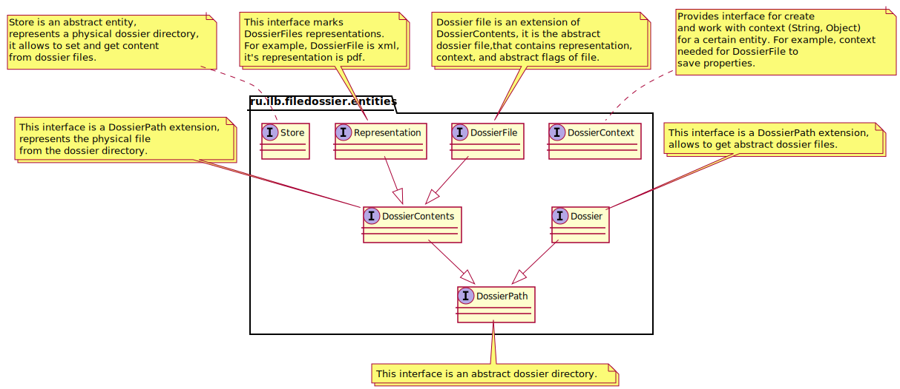

# filedossier
Файловое досье
==============

Структура Dossier:
------------------
Dossier
|
└─ code
└─ name
└─ DossierFile
  |
  └─ parent
  └─ code
  └─ name
  └─ mediaType
  └─ Store
    |
    └─ storeKey
    └─ storeRoot
    └─ Representation
      |
      └─ parent

Core:
-----

